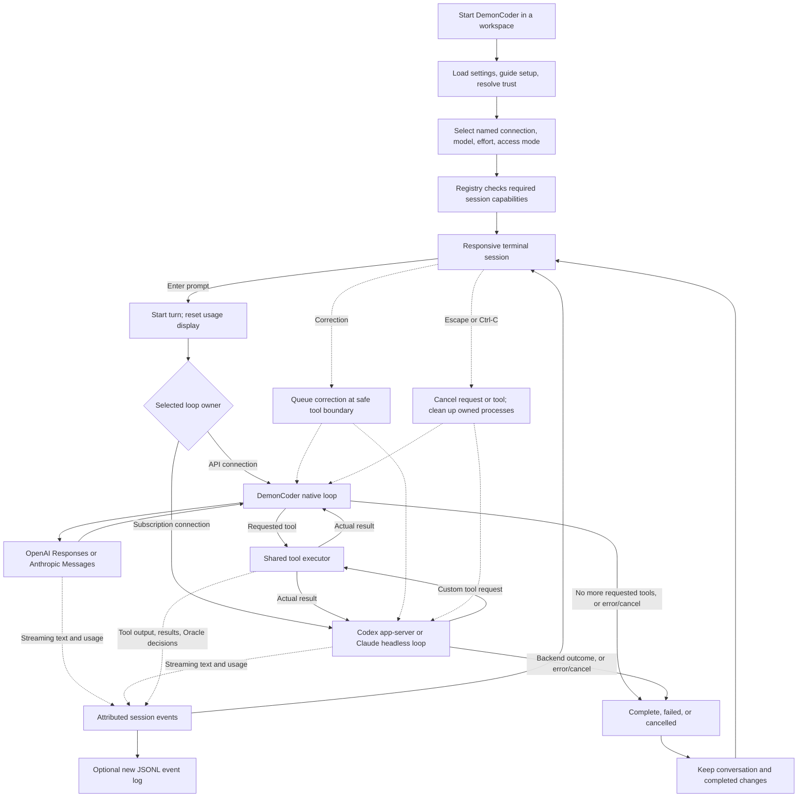
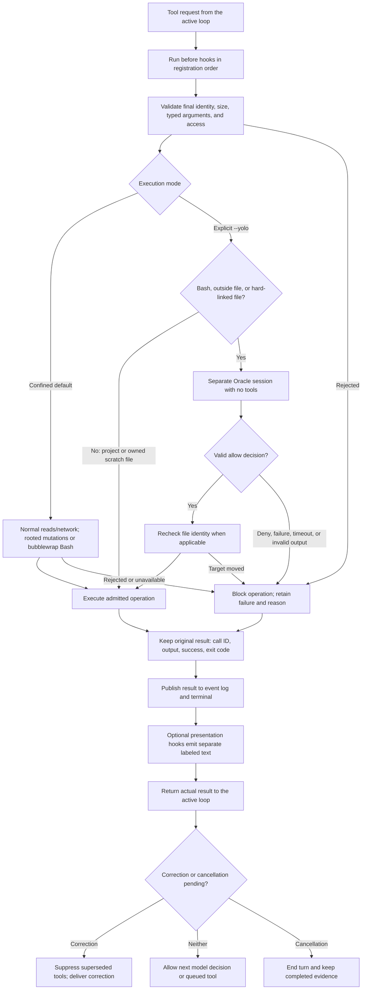

# DemonCoder

DemonCoder is a Rust terminal coding assistant. Open it in a project, choose a
connection, and work through a continuing conversation. Watch assistant text and
tool output as they arrive, submit a correction while work is running, or cancel
one turn and continue in the same session.

The implemented first release provides four connections, four coding tools,
guided setup, named model assignments, typed hooks, and an optional Oracle guard
for explicit host execution. It runs on Linux.

The Creator agent identifies as Demoncoder across all four connections,
regardless of the selected model. It can still report the underlying model or
provider when asked. Its shared prompt in `src/adapters/creator.md` also sets
production coding, verification, delivery, and plain-language rules. The Oracle
retains its separate review role.

## Contents

- [Quick start](#quick-start)
- [Terminal controls](#terminal-controls)
- [How the coding loop works](#how-the-coding-loop-works)
- [Connections and authentication](#connections-and-authentication)
- [CLI reference](#cli-reference)
- [Settings manual](#settings-manual)
- [Coding tools](#coding-tools)
- [Project trust and execution modes](#project-trust-and-execution-modes)
- [Steering, cancellation, and continuation](#steering-cancellation-and-continuation)
- [Usage, results, and event logs](#usage-results-and-event-logs)
- [Task verification and recovery](#task-verification-and-recovery)
- [Assignable subagents](#assignable-subagents)
- [Advanced orchestration](#advanced-orchestration)
- [Evidence-based improvement](#evidence-based-improvement)
- [Extending DemonCoder](#extending-demoncoder)
- [Limits and troubleshooting](#limits-and-troubleshooting)
- [Development and verification](#development-and-verification)
- [Implementation map and project status](#implementation-map-and-project-status)

## Quick start

### Requirements

| Requirement | Purpose |
|---|---|
| Linux with `openat2` support | Required by the native file tools. |
| Rust 1.95 or newer and Cargo | Build the Rust 2024-edition application. |
| An interactive terminal | Both standard input and standard output must be terminals. |
| `/usr/bin/bwrap` and working namespace support | Required for Bash in the default confined mode. |
| `/bin/bash` | Runs commands requested by the model. |
| At least one configured connection | An API key, or an installed and authenticated subscription backend. |

API connections use the application's HTTP client. They do not require the Codex
or Claude executable. Subscription connections require the corresponding local
executable; install and authenticate it before using that connection.

From this repository:

```bash
cargo build --locked
./target/debug/demoncoder --workspace /absolute/path/to/project
```

To install the binary into Cargo's binary directory:

```bash
cargo install --path . --locked
demoncoder --workspace /absolute/path/to/project
```

These examples assume Cargo's binary directory is on `PATH` after installation.
You can also run without installing:

```bash
cargo run --locked -- --workspace /absolute/path/to/project
```

### First start

When no explicit configuration is supplied and onboarding has not been completed,
DemonCoder guides you through setup:

1. Authorize the selected project for coding tools.
2. Use Space to select one or more provider/authentication checkboxes.
3. Supply a masked API key, or check the backend's existing subscription login.
4. Continue to the Creator model selector after the selected providers authenticate.
5. Assign models to Worker, Oracle, Reviewer, Advisor and Judge, or leave them on
   **Use Creator model**. Enter assigns a highlighted model; Escape keeps the prior choice.
6. Continue with these assignments to save private settings and start the session.

API choices check the selected key against the provider's model catalog. Codex
checks its account and discovers models without starting a coding thread. Claude
checks subscription login and labels its model aliases as supported choices.
An authenticated account may still lack access to an advertised model. Failed
discovery remains visible; use `r` to retry a selected provider. Escape cancels
the current check or returns to the previous screen.

API-key entry is masked. A nonempty environment key takes precedence over a saved
key. Setup saves to `~/.demoncoder/settings.toml` by default. Saved settings files
use mode `0600`; settings directories use `0700`. During setup or a trust update,
an existing user-owned default `~/.demoncoder` directory is secured to `0700`
without deleting its contents. Symlinked or foreign-owned directories are rejected.

Reopen setup with:

```bash
demoncoder --setup --workspace /absolute/path/to/project
```

`--setup` saves the choices and then starts a session. It is not a setup-only exit
command. Existing named connections are retained. Use `/settings` or Ctrl-S to
edit provider selections and role assignments during a session. To add a custom
named endpoint or remove a saved trusted project, edit the private settings file.
Settings supports up to 64 named connections. At capacity, remove an unused
entry from the private file before adding a different provider.

### Live provider and role settings

Settings uses the same provider checks and model selectors as onboarding. The
role list shows whether each role inherits Creator or has an explicit override,
along with its effective model, provider and authentication method. An inherited
role follows later Creator changes; an override stays until changed or restored
to **Use Creator model**. Oracle decides outside access, Reviewer examines task
patches, and Advisor and Judge supervise delegated work.

Choose **Save and return to conversation** to apply the edited assignments.
Escape returns without saving. The screen preserves your prompt draft and chat
position, including while work is running. Assignments do not enable delegation,
review, orchestration or additional permissions. Enable the existing features
with their launch flags; `default` selects the corresponding Settings role for
`--agent-connection`, `--reviewer` and `--judge` when no connection is named `default`.
An explicit named connection or command-line model keeps its applicable precedence.

Saved changes apply when subsequent work is admitted. A running task, invocation
or queued child keeps its captured model, account, permissions and allocation.
An active `/task` keeps Creator until accepted or abandoned; a later Reviewer
invocation resolves its then-current default. Switching an external backend
starts a separate context and displays a notice; its opaque session is not transferred.
Recovery retains original evidence and allocations and refuses an identity it
cannot safely restore.

Deselection keeps existing assignments visible as unresolved and blocks affected
new work until repaired. It does not substitute another provider. Saves use the
private settings lock and atomic replacement. A failed or conflicting save stays
unapplied with an error; reopen Settings to load a competing update.

### A first coding task

At the `Prompt` editor, enter a request such as:

```text
Read the existing parser and its tests. Fix the empty-input case, add a regression test, and run the relevant checks. Report the actual results.
```

Press Enter. While the task is running, you can type a correction:

```text
Keep the public API unchanged. Use the existing error type.
```

Press Enter again to queue it. Press Escape to cancel the active turn. When the
turn ends, submit another prompt to continue with its conversation and completed
file changes.

The model chooses tool calls and interprets their results. A completed turn means
the runtime finished that turn; inspect the actual test results before treating a
coding task as correct.

## Task verification and recovery

Native OpenAI and Anthropic API sessions support an explicit task workflow.
Select checks and a configured reviewer before starting:

```bash
demoncoder --workspace /path/to/project --check 'cargo test --locked' \
  --reviewer review-model --correction-rounds 2 \
  --task-seconds 900 --task-model-calls 64 --task-tool-calls 128
```

The reviewer name refers to a connection in your private settings. Ordinary
conversation still works on all four connections. External agent backends cannot
currently enforce individual call allocations or restore their opaque internal
state, so explicit tasks and `--resume` require a native API connection.

| Prompt | Behavior |
|---|---|
| `/task <objective>` | Start a task with the selected checks, reviewer and cumulative allocation. |
| `/verify` | Run the selected commands under the current tool-access policy and retain their original results. |
| `/review` | Give the tool-free reviewer the objective, actual workspace changes, source and check history. |
| `/correct` | Return retained findings to the worker, then rerun checks and obtain a fresh review. |
| `/accept` | Explicitly accept only when all selected checks pass and review is clear for the current workspace. |
| `/task-status` | Display a readable first page of task evidence, actions and recorded status; F2 opens retained history. |
| `/abandon` | Archive the task and its evidence, preserving all workspace files. |
| `/reconcile <inspection explanation>` | Record your inspection of uncertain or changed work so execution can continue. |
| `/workflow-help` | Display workflow controls. |

No checks means unverified. Model completion never accepts a task. An edit after
verification or review invalidates that evidence for acceptance. After evidence
has been collected, use `/correct` to continue work; ordinary prompts cannot
bypass the correction allowance. Commands require stopped work: cancel or wait
before submitting them. Escape cancels checks, review and correction too.

The default two correction rounds can be configured from zero to twenty before a
task starts. The deadline includes time between prompts and time while the app is
closed. Worker, Oracle, checks, review and corrections share the same finite call
and tool allowances; resuming does not reset them. Limits are 1–86,400 seconds
and 1–4,096 model or tool admissions. Reported token and cost totals retain unknown
values when the connection does not report them. `--task-token-limit` and
`--task-cost-limit` are rejected because the current adapters cannot enforce hard
total token or monetary caps.

Each session prints its private recovery directory under
`~/.demoncoder/sessions/`. Resume with the same workspace, connection, access mode
and task reviewer:

```bash
demoncoder --workspace /path/to/project --reviewer review-model \
  --resume /home/you/.demoncoder/sessions/PRINTED-SESSION
```

Records contain conversation, tool arguments and results, source evidence and
decisions. Directories use mode `0700`, files use `0600`, and concurrent writers
are refused. Preserve these sensitive records privately. A damaged record or
failed durable write holds execution. Interrupted operations are uncertain and
are never automatically repeated. Inspect the actual files and effects, then use
`/reconcile` with what you found. This records your judgment; it does not undo an
effect or infer whether an interrupted command succeeded. A changed workspace
while closed also requires inspection. Ordinary conversations have no acceptance
snapshot and require workspace inspection on every resume. Their reconciliation
records your explanation without capturing private files in a home workspace.

Task capture includes untracked files and pre-existing changes, excluding only
the root `.git` entry. It uses repeated bounded scans, not an atomic filesystem
snapshot; avoid concurrent edits during checks and review. Limits are 8 MiB per
file, 64 MiB total content, 20,000 entries, depth 64 and ten seconds per capture.
Special files, hard links, mounted subtrees and unsupported path names block
capture. Symbolic links are recorded without following targets. Review evidence
is limited to 1 MiB; changed binary files or evidence that cannot fit block review
visibly. The project must exclude private session and credential paths.

Retention is finite: 32 archived tasks, 128 evidence generations, 4,096 operations,
128 recorded decisions and an 8 MiB conversation within a 64 MiB session record.
Reaching a retention limit stops further affected work; preserve the record and
start a new session. No automatic checkout, cleanup, commit or deletion occurs.

## Evidence-based improvement

A failed verification can become a cited correction candidate. Inspect its
original result, add your explanation, authorize an ordinary task, and use its
executed checks and review to assess the outcome. A supported correction can
become a workspace lesson after your explicit approval. Discovery and inspection
never invoke a model or execute coding tools.

Start a native task session with the behavioral command you intend to preserve,
for example `--check 'test -s greeting' --reviewer review-model`. After a failed
`/verify`, use:

```text
/improvements
/improvement 1
/improvement-note 1 The greeting was empty; investigate its producer.
/abandon
/improve 1
/verify
/correct
/improvement-outcome 1
/accept
/lesson-propose 1 {"claim":"Verify nonempty greeting output before accepting a change.","keywords":["greeting"]}
/lesson-enable 1
```

The numbers are the identifiers printed by `/improvements`; do not assume they
are always `1`. `/abandon` preserves the original task and files. `/improve`
requires the current task to be accepted or abandoned and the candidate's
behavioral command to be among the session's selected `--check` commands. It
reserves one authorization before creating the correction task. If interrupted,
that reservation cannot create another task; inspect it and create a new proposal
only if you intend to authorize new work. Resuming an existing correction keeps
its original connection authority and consumed allocation.

| Command | Behavior |
|---|---|
| `/learning-context [PAGE]` | Inspect prepared coding contexts and restore their F2 view. |
| `/improvements` | Detect failed checks in the current session and show the saved workspace catalog. Repeat detection does not duplicate original receipts. |
| `/observation ID [PAGE]` | Inspect an observation, attributed annotations and its original receipt. |
| `/improvement ID [PAGE]` | Inspect a candidate, source evidence, authorization and outcome history. |
| `/improvement-note OBS TEXT` | Add a developer explanation without changing the original result. |
| `/improvement-propose OBS JSON` | Propose `objective`, `scope`, `benefit`, `behavioral_check` and `risks` as nonempty string fields. Explanations remain proposals. |
| `/improve ID` | Explicitly authorize one ordinary native correction task with cited evidence in its actual worker context. |
| `/improvement-outcome ID` | Compare the correction's retained checks and review with the original behavioral command and a current workspace capture. |
| `/lesson-propose CANDIDATE JSON` | Propose `claim` and an array of `keywords` from a supported outcome. The new lesson starts disabled. |
| `/lesson ID [PAGE]` | Inspect a lesson and its source history. |
| `/lesson-enable ID` | Approve future use after validating supporting source receipts. |
| `/lesson-disable ID` | Stop future selection, even if its original source is unavailable. |
| `/lesson-supersede OLD NEW` | Disable the old lesson in favor of an already enabled replacement while preserving history. |

Annotations can also cite a current session's retained evidence directly:
`task-check:ID:ROUND:INDEX`, `task-review:ID`,
`agent-check:ID:GENERATION:INDEX`, `agent-review:ID`, or
`agent-role:ID:INDEX`. For example, `/improvement-note task-review:2 TEXT`
creates an observation of task 2's current retained review. Receipt indexes and
task check-history rounds start at zero. Inspect the new observation with
`/observation`; original task and agent inspectors still expose their receipts.

A correction outcome is **supported**, **unresolved**, or **insufficient**.
Support requires the exact originally failing command to pass, all selected
checks to pass, and clear review on the same current files. Accepting an unrelated
passing task does not establish improvement. Verification, review, acceptance and
abandonment retain outcomes automatically; `/improvement-outcome` can refresh the
assessment explicitly. Earlier failed and abandoned outcomes remain beside later
success. A supported outcome establishes the specified behavior, not every
proposed benefit or the truth of every explanation. Review must still challenge
weakened checks and unsupported claims.

### Lesson delivery and repository instructions

Enabled lessons apply only to their canonical workspace directory identity,
including later sessions there. Matching is deterministic: at least one of the
lesson's 1–8 keywords must match a whole Unicode alphanumeric word in the coding
objective, ignoring case. Unrelated, disabled and superseded lessons are excluded.
Up to four matching lessons enter each actual parent or child coding request on
all four connections. A receipt retains their identities, workspace, sources,
selection reasons and exact prepared context. Additional matches are reported as
omitted. This adds no model-based proposal generation or hidden model calls.

Context preparation loads the selected coding workspace's root `AGENTS.md`.
For child work it also checks `AGENTS.md` along the ancestors of declared owned
paths, inside that child's worktree. Nested files apply only to their own subtree.
It does not scan unrelated directories, follow imports, or load ancestors outside
the workspace. Runtime invariants come first, then developer directions, applicable
repository instructions, and quoted lesson evidence. Neither files nor lessons
grant tool permissions or child integration authority.

F2's Learning target shows the last explicitly requested catalog view. Use
`/learning-context [PAGE]` to inspect prepared coding-context receipts; those
receipts also appear in their task or agent inspection. Before requesting a
catalog view, F2 shows the context receipts by default. Context is
retained before an adapter call; delivery and effects are established by the
corresponding provider/tool receipts. Inspection and F5 show saved evidence and do
not recheck files. Disabling a lesson stops new selection; it cannot erase text
already supplied to an opaque backend conversation.

### Learning storage and limits

Private catalogs live under `~/.demoncoder/learning/`, keyed by the canonical
workspace path and directory identity. They use the session Store's checksummed
atomic replacement and private permissions. Original receipts under
`~/.demoncoder/sessions/` remain authoritative. Missing, damaged, changed or
other-workspace sources block dependent claims and lesson delivery with an
explanation; a copied summary is never substituted for proof.

Limits are explicit: 8 MiB per catalog, 128 observations, 64 candidates, 64 lessons,
128 total annotations, and 128 outcomes per candidate or history entries per
lesson. Text fields are at most 4 KiB; a behavioral command is at most 8 KiB.
Discovery examines one session and at most 4,096 retained checks. Other source
retrieval reads at most eight sessions and 64 MiB of aggregate evidence per
operation. Inspection retains at most 8 MiB and displays pages of about 8 KiB.
Full storage refuses additional work without evicting earlier evidence.

Per request, instruction selection checks at most 32 paths with depth 32 and
reads at most 32 KiB. Lesson context is limited to 32 KiB and prepared context to
96 KiB. A session retains at most 128 coding-context receipts. Unavailable or
oversized instruction files produce an explicit refusal rather than silently
claiming complete retrieval. Symbolic links, hard links and special files are refused.

Learning file access runs off the terminal input path, with four blocking I/O
slots and a ten-second wait limit. Busy catalogs refuse concurrent writes.
Escape cancels the operation; an already running filesystem save may finish,
but cancellation never starts a correction. Inspect the catalog before repeating
an interrupted command. No automatic cleanup or effect replay occurs.

## Assignable subagents

Enable named child connections before starting a session:

```bash
demoncoder --workspace /path/to/project --agent-connection worker-model \
  --agent-connection codex --check 'test -s result.txt' --reviewer review-model
```

Enabled children can use OpenAI API, Anthropic API, Codex subscription or Claude
subscription connections independently of the parent. Each gets a real Git
worktree containing the parent's current files, including uncommitted and
untracked content. The parent can delegate through its `delegate` tool and inspect
results with `agent_status`. Without `--agent-connection`, the four original tools
remain the complete tool surface.

| Control | Behavior |
|---|---|
| `/delegate CONNECTION OWNED,PATHS OBJECTIVE` | Assign work using the selected connection, owned paths, startup checks and reviewer. |
| `/agents` | List retained assignments and their current states. |
| `/agent ID` | Show a readable first page of assignment and validation evidence; F2 opens the full paginated inspector. |
| `/agent-cancel ID` | Stop one child or cancel a completed assignment while retaining its files. |
| `/agent-validate ID` | Run the selected checks and obtain an independent review of the current child patch. |
| `/agent-integrate ID` | Explicitly apply a completed child's current validated changes to the parent. |
| `/agent-reconcile ID EXPLANATION` | Record inspection of an interrupted assignment without replaying its work. |

Child tools and validation commands always use worktree confinement, including
under a `--yolo` parent. They cannot access user home files, credentials, other
repositories or shared Git administration. Oracle approval cannot expand this
boundary. Shell tools have minimal system executables and libraries, no network
and no home-installed toolchains. Failure to establish confinement blocks work.

Completion prose does not authorize integration. Checks must pass and review must
be clear for the current child files. Integration preserves unrelated parent
edits and rejects conflicts or changes outside ownership. Keep files stable during
integration: freshness checks do not provide an atomic filesystem transaction
against arbitrary external writers. Successful integration invalidates parent
acceptance and requires fresh verification. Worktrees and retained commits remain
available for inspection; the parent index is preserved.

The default limit is two active children (`--agent-limit`, range 1–8). Parent,
children, checks and review share the absolute `--task-seconds` deadline and
`--task-tool-calls` allowance. Native calls consume `--task-model-calls`; external
backend invocations use the separately named `--agent-backend-turns` allowance
(default 64, range 1–4,096). A backend's internal calls, tokens and spending cannot
be capped by that invocation count. Unreported usage remains unknown.

Escape cancels active children with parent work; quitting closes their owners.
Inspection and individual cancellation remain available during parent work.
Starting work, validation and integration require the parent to stop first.
Interrupted children and integrations become uncertain; resume never replays
them. Resume the native parent with the original enabled connections, inspect
each uncertain child, and reconcile the parent too when requested. Opaque backend
conversations are not automatically restored. Retention is bounded to 32
assignments and 2 MiB/2,048 activity entries per child, within the shared record.

## Advanced orchestration

Enable dependency scheduling and automatic supervision with the same named
connections and checks used for subagents:

```bash
demoncoder --workspace /path/to/project --agent-connection worker-model \
  --check 'test -s result.txt' --reviewer advisor-model \
  --orchestrate --judge judge-model
```

`--orchestrate` requires enabled child connections, at least one check, a reviewer
and a judge. The reviewer acts as advisor. Each supervision role has a fresh,
tool-free context and retains its selected connection and model. Connections can
use any of the four adapters. Selecting the same connection for different roles
still creates separate contexts.

Ordinary `/delegate` assignments run when capacity is available. Add prerequisites
with `/delegate-after IDS CONNECTION OWNED,PATHS OBJECTIVE`, for example:

```text
/delegate worker-model parser.rs implement the parser
/delegate-after 1 worker-model parser_test.rs test the integrated parser
```

The parent `delegate` tool accepts the equivalent `depends_on: [1]` field only
when orchestration is enabled. Prerequisites must name earlier assignment IDs;
unknown, repeated, self and forward references are refused. Waiting assignments
remain visible and count toward the 32-assignment retention limit. Independent
work runs within `--agent-limit`; preparation, checks and supervision also occupy
active slots.

A dependent waits until every prerequisite has passed current validation and you
have explicitly run `/agent-integrate ID`. Completion or a clear advisor verdict
alone does not release it. The dependent's worktree is created when it starts, so
it contains the integrated prerequisite changes. Failed, cancelled or uncertain
prerequisites hold their dependents with a reason; unrelated work can continue.

After worker completion, the runtime checks the actual child files and gives the
advisor the patch, source and check results. A clear advisor verdict and passing
checks make the assignment ready for your integration command. Findings go to a
tool-free response under the worker connection, then to the judge with the original
findings and runtime evidence. The judge can resolve the dispute or request
correction. Every correction reruns checks and supervision. At most two corrective
worker turns are admitted per assignment; revalidation and restart do not reset
that count. Invalid output, unresolved findings, exhausted allowances or failed
checks hold the result. Agent messages cannot authorize integration.

Use `/agents` for waiting reasons and active roles, and `/agent ID` for original
findings, responses, judgments and correction counts. Parent prompts and inspection
remain available while children run. `/agent-cancel ID` stops one assignment;
Escape and shutdown also cancel queued work before stopping active descendants.
Every role and correction uses the existing shared deadline and applicable native,
tool or backend invocation allowances described above.

Resume with the original orchestration options and connections. Interrupted work
remains uncertain, and queued work never starts automatically on recovery. Inspect
the retained files and evidence, reconcile uncertain assignments and the parent
when requested, then use `/agents-resume` to resume eligible queued assignments.
Recovery retains prerequisite IDs, integration state, original role evidence and
spent correction counts. It cannot restore an external backend's opaque internal
conversation or infer whether an interrupted effect succeeded.

## Terminal controls

F2 opens a read-only inspection view while preserving the prompt draft and the
conversation scroll position. Tab/Shift-Tab select the overview, current task,
agents and archived tasks. Left/Right change evidence pages; Page Up/Down, arrows
and the mouse wheel scroll the selected page. F5 refreshes saved evidence. F2 or
Escape closes inspection; Ctrl-C cancels work even while inspection is open.
Navigation does not run a command, accept a task or integrate an agent.

The status strip reads actual active, waiting, held and ready counts from the
shared runtime instead of counting chat notices. Held includes stopped, failed,
cancelled and uncertain assignments; integrated assignments remain inspectable.
A separate task row distinguishes work, verification, review and acceptance.
These are recorded results, not a new filesystem check. The inspector repeats
that freshness limit as "files not rechecked" and displays the original snapshot identity. Acceptance and
integration still recheck actual files and authority through their existing
commands. A ready count does not mean changes are integrated.

The background reader samples saved state every 250 ms without waiting for the
record lock. If a snapshot is more than one second old, counts become unknown
with a refresh notice. Persistence errors show unavailable state. No model call,
filesystem scan or durable write is triggered by F2. Inspection keeps one page
of up to 8 KiB of source text (plus a crossing Unicode character); original
control characters are rendered inert. Evidence pages stay fixed until F5 or a
page/target change, so arriving output does not move the text being read. Current
counts continue to refresh. A page-limit or missing-state condition is explicit.

Labeled sections show objectives, model identity, ownership, original checks,
findings, responses and judgments. Source evidence is captured for review;
missing source is named rather than fabricated. Supplemental original role and
activity inputs remain available on later pages. Suggested commands explain
consequences and remain requests: the runtime can refuse changed state, exhausted
allowances, missing evidence or a conflicting workspace.


| Input | Behavior |
|---|---|
| Enter with nonempty text while idle | Start a new turn. |
| Enter with nonempty text while working | Queue a correction for the next safe tool boundary. |
| Escape | Clear a selection first; otherwise cancel an active turn. |
| Ctrl-C while working | Cancel the active turn. |
| Ctrl-C while idle | Clear the input editor. |
| Ctrl+Shift+C forwarded to the application | Copy the current prompt text. |
| Ctrl+Shift+V | Paste from the terminal clipboard into the prompt. |
| Ctrl-Q | Quit the application and close the session runtime. |
| Ctrl-O | Toggle all retained assistant/tool output between compact and full views. |
| Ctrl-S or `/settings` | Open provider and role Settings; Ctrl-S preserves an unfinished prompt. |
| Page Up / Page Down | Scroll backward or forward one page. |
| Up / Down | Scroll one visual row. |
| Drag the scrollbar | Move the compact or full chat viewport. |
| Drag over chat text | Freeze visible rows and select text. |
| Ctrl-Y with selected text | Request clipboard copy through OSC 52. |
| Mouse wheel over the chat | Scroll three visual rows. |
| Home / End | Show the oldest retained chat / return to the latest output. |
| Backspace | Remove the final character of the input. |
| Ordinary text | Append to the input, including while output is streaming. |

The header shows the named connection, execution mode, and status. Its working
indicator animates during silent waits and shows the active tool target when
available. The body shows assistant text, tool activity, original results, and
Oracle decisions. The editor changes from `Prompt` to `Correction` while work runs.
The strip below it shows model, context used/remaining, dirty files and branch,
diff additions/deletions, active subagents, then reported tokens and cost. Narrow
screens clip trailing fields. The separate help line retains scroll controls.
New output preserves a viewport you scrolled back; End or a new prompt returns to
the latest output. Resizing preserves the reading position.

Mouse selection freezes up to 256 KiB and 1,024 visible rows while the session
continues. New output and final tool receipts cannot change selected bytes.
Ctrl-Y requests copying those bytes; the terminal must support and allow OSC 52.
The application reports a copy request, not confirmation that the system clipboard
changed. Resize clips the frozen display without changing the selected bytes.
Escape, scrolling, expansion, a new selection or a prompt clears the selection.
Hold Shift for terminal-emulator selection where supported.

Chat uses labeled markers for prompts, assistant responses, and tool activity.
Tool headings show the operation and target, then update to the actual result or
interruption. Long assistant/tool blocks show six wrapped rows from the start,
a hidden-row count, and two rows from the end. Ctrl-O exposes the retained middle
without resubmitting anything. Source reads and supported fenced code use syntax
colors. Unknown languages and oversized highlighting inputs remain plain text;
Markdown prose and links retain their literal notation. A scrollbar follows the
current compact/full view, with two empty terminal columns outside it.

Prompt shortcuts are separate from transcript selection. Ctrl+Shift+C copies the
whole current prompt; Ctrl+Shift+V uses the terminal emulator's paste action.
Bracketed paste stays in the editor until Enter: newlines and control characters
are removed, and the 64 KiB input limit still applies. Terminal emulators may
reserve Ctrl+Shift+C for native selection; to copy the application prompt, they
must forward that key with distinguishable modifiers. Compatible terminals are
asked for enhanced key reporting. Clipboard copying still requires OSC 52 support.

The editor currently appends and backspaces at the end. Cursor navigation,
command history, multiline composition, transcript search, and a connection picker
inside an active session are not implemented. Choose another connection when
starting a new application session. Input is bounded to 64 KiB. Retained chat is
bounded to 1 MiB and 16,384 logical lines, including its line/index entry count.
An ordered index locates the viewport; cached wrapping lets idle frames render
only visible rows. Older displayed chat expires at the retention limit and the
terminal shows an explicit notice. This bounds display storage, separately from
the model's conversation history; it is not provider-context compaction or session
recovery.

Prompt submission keeps the draft until the runtime accepts it. A full command or
correction queue leaves the draft editable and shows a reason. If you edit while
admission is pending, acceptance preserves the edited draft. At most one submission
waits for admission, and each active turn queues at most 32 unapplied corrections. Cancellation
and quit remain responsive while either queue is full.

## How the coding loop works

A **session** is the continuing conversation plus its selected workspace and
connection. A **turn** starts when you submit a prompt and ends in completion,
cancellation, or failure. One loop owner advances each session:

- **OpenAI and Anthropic API:** DemonCoder's shared native loop requests model
  responses, runs admitted tools, returns their results, and requests more work.
- **Codex and Claude subscription:** the external backend owns model/tool
  progression. DemonCoder supplies the terminal, session controls, and shared
  tool executor through the backend's custom-tool transport.

### Session and loop diagram



The two owner branches are alternatives for a session. DemonCoder does not run a
second model loop alongside an external backend. Both branches use the same
admission and execution path for coding tools.

### Tool admission and feature interaction



This diagram shows the normal result path. Cancellation can also interrupt a
provider request, Oracle review, or running tool. The executor keeps a completed
receipt before awaiting publication, so interrupted delivery or a presentation
failure cannot turn a known result into an invented success.

## Connections and authentication

| Adapter ID | Transport and loop owner | Authentication | Model selection |
|---|---|---|---|
| `openai-api` | OpenAI Responses API; DemonCoder loop | `OPENAI_API_KEY` or private saved `api_key` | Required. |
| `anthropic-api` | Anthropic Messages API; DemonCoder loop | `ANTHROPIC_API_KEY` or private saved `api_key` | Required. |
| `codex` | Local `codex app-server`; Codex loop | Codex-managed ChatGPT login | Optional; omission uses backend defaults. |
| `claude` | Local Claude headless stream-JSON process; Claude loop | Claude's subscription login | Optional; omission uses backend defaults. |

Authenticate subscription backends using their own commands:

```bash
codex login
claude auth login
```

DemonCoder preserves the backend's home login location. `CODEX_HOME` and
`CLAUDE_CONFIG_DIR` can select existing backend configuration/login directories.
The Claude adapter also forwards `CLAUDE_CODE_OAUTH_TOKEN` when explicitly present.
DemonCoder does not implement its own subscription login exchange.

API keys and subscription authentication are separate choices. Subscription
processes do not inherit `OPENAI_API_KEY` or `ANTHROPIC_API_KEY`, and subscription
settings reject `api_key`. Codex must confirm a ChatGPT account; Claude must confirm
its subscription route before output, tools, or successful completion are accepted.
Missing or expired authentication fails without changing accounts or billing
methods. Provider rejection does not trigger an automatic model substitution.

Subscription sessions expose DemonCoder's four admitted tools. They do not expose
the entire backend product: built-in tool paths, inherited MCP servers, and other
tool sources are disabled or rejected so work passes through the shared executor.
Backend login state is reused; arbitrary backend plugins and skills are not loaded
as DemonCoder extensions.

The native OpenAI adapter uses streaming Responses with `store: false` and retains
returned encrypted reasoning items in its in-memory conversation for subsequent
requests. The native Anthropic adapter streams Messages and currently requests
`max_tokens: 4096` per response. Neither setting has a CLI override. Both native
adapters preserve model conversation in memory across turns; DemonCoder does not
provide automatic context compaction.

Named connections let you save several assignments, including multiple entries
for the same adapter. For example, `everyday` and `reviewer` may select different
models through one provider.

## CLI reference

`--context-window N` supplies a positive context capacity for the status display.
It does not set the provider output limit.

```text
demoncoder [OPTIONS]
```

There is no positional task argument or subcommand. Submit task text in the
terminal. Piped stdin and non-terminal stdout are unsupported; even an invocation
with explicit configuration still requires a terminal for the session UI.

| Flag | Default | Effect |
|---|---|---|
| `--workspace <WORKSPACE>` | `.` | Select the existing directory authorized for this session. The path is canonicalized. |
| `--config <CONFIG>` | `~/.demoncoder/settings.toml` | Use a complete alternative trusted TOML file. It does not merge with the home file or grant project trust. |
| `--connection <CONNECTION>` | Saved `default_connection` | Select a named connection. A built-in adapter ID also works without a saved entry, provided required credentials/model are supplied. |
| `--model <MODEL>` | Selected connection's saved model, otherwise backend default where supported | Override the coding connection's model for this invocation. |
| `--effort <EFFORT>` | Selected connection's saved effort, otherwise provider/backend default | Override the coding connection's thinking/response effort. See accepted values below. |
| `--max-output-tokens <MAX_OUTPUT_TOKENS>` | Saved limit, otherwise model/provider default | Set a positive response-token limit for a native API connection. |
| `--setup` | Off | Reopen guided configuration, save choices, then start the selected session. |
| `--yolo` | Off | Explicitly select unsandboxed host tool execution for this invocation. Requires a saved Oracle assignment and authorizes the selected workspace for this invocation. |
| `--trust-workspace` | Off | Authorize the selected workspace for this invocation without saving permanent trust. It does not enable host execution. |
| `--event-log <EVENT_LOG>` | No file | Create a new JSONL session-event file. An existing destination is rejected. |
| `-h`, `--help` | — | Print help and exit. |
| `-v`, `-V`, `--version` | — | Print the application version and exit. |

Model, effort, and output-limit flags are invocation overrides. When supplied with `--setup`,
they also seed the coding connection choices being saved. They do not override
the separate Oracle model or effort assignment.

Examples after initial setup:

```bash
# Use the saved default connection in the current directory.
demoncoder

# Select a saved connection for another project.
demoncoder --workspace /path/to/project --connection everyday

# Override a saved model assignment.
demoncoder --connection codex --model YOUR_CODEX_MODEL --effort high

# Use a separate trusted configuration and one-time project authorization.
demoncoder --config /private/settings.toml --workspace /path/to/project --trust-workspace

# Retain events in a new file outside the project's tool work area.
demoncoder --workspace /path/to/project --event-log /private/logs/session-001.jsonl

# Use installed host toolchains and host access with the Oracle guard.
demoncoder --workspace /path/to/project --yolo
```

Replace placeholder paths and model IDs with your actual selections. Event-log
parent directories must already exist. Relative `--config` and `--event-log`
paths are resolved from the application's launch directory, not `--workspace`.

## Settings manual

The default file is `~/.demoncoder/settings.toml`. Repository configuration files
are never discovered automatically. The older `~/.demoncoder/config.toml` format
is not read by this application.

### Example configuration

This example uses subscription logins for the default and Oracle, and environment
credentials for the API entries. Replace the example trusted path before using it.
The API model names are examples; use provider discovery to choose an available
model. Model availability and accepted effort remain the selected service's decision.

```toml
onboarding_complete = true
default_connection = "everyday"
trusted_workspaces = ["/absolute/path/to/project"]

[connections.everyday]
adapter = "codex"
# Omit model and effort to use backend defaults.

[connections.claude]
adapter = "claude"
# binary = "/absolute/path/to/claude"

[connections.openai]
adapter = "openai-api"
model = "gpt-6-astra"
effort = "high"
# api_key = "YOUR_PRIVATE_KEY" # optional when OPENAI_API_KEY is set

[connections.anthropic]
adapter = "anthropic-api"
model = "claude-sonnet-4-6"
effort = "high"
# api_key = "YOUR_PRIVATE_KEY" # optional when ANTHROPIC_API_KEY is set

[oracle]
connection = "claude"
# model = "YOUR_ORACLE_MODEL"
# effort = "high"
```

### Top-level settings

| Key | Meaning |
|---|---|
| `onboarding_complete` | Defaults to `false`. Guided setup sets it to `true`. An explicit `--config` suppresses automatic onboarding, but not trust checks. |
| `default_connection` | Named connection or built-in adapter selected when `--connection` is omitted. |
| `trusted_workspaces` | Saved trusted canonical project roots. Trust covers their descendants. Defaults to an empty list. |
| `connections` | Map of names to connection settings. |
| `oracle` | Assignment used by `--yolo` for outside-access reviews. |
| `settings` | Selected providers, Creator assignment and explicit role overrides saved by the shared editor. Legacy connections and Oracle assignments remain readable. |

The editor persists assignments separately from connections so inheritance stays
live. For example:

```toml
[settings]
providers = ["openai", "anthropic"]
[settings.creator]
connection = "openai"
model = "YOUR_DISCOVERED_MODEL"
[settings.overrides.reviewer]
connection = "anthropic"
model = "YOUR_REVIEW_MODEL"
```

Other roles inherit Creator unless their own override is present. Each assignment
accepts `connection`, optional `model`, and optional `effort`. Existing explicit
Oracle settings are preserved when migrating a configuration without this section.

### Connection settings

Each `[connections.NAME]` accepts the following fields. Unknown fields are rejected.

| Key | Meaning |
|---|---|
| `adapter` | Required adapter ID: `openai-api`, `anthropic-api`, `codex`, `claude`, or an adapter registered by an application build. |
| `model` | Model identifier. Required for API adapters; optional for subscription adapters. |
| `effort` | Optional thinking/response effort. Omission preserves provider/backend defaults. |
| `max_output_tokens` | Optional positive integer for native API connections. Overrides model discovery/provider defaults. Rejected for subscription backends. |
| `api_key` | Optional API credential stored in this private file. Rejected for subscription connections. |
| `endpoint` | Optional full API URL, including the request path. Rejected for subscription connections. |
| `binary` | Optional backend executable path. Otherwise `codex` or `claude` is found on `PATH`. Rejected for API connections. |

A custom endpoint must implement the selected adapter's actual API protocol; it is
not a universal compatibility switch. Default URLs are:

```text
OpenAI:    https://api.openai.com/v1/responses
Anthropic: https://api.anthropic.com/v1/messages
```

Endpoints require HTTPS, except HTTP to a literal loopback IP such as
`http://127.0.0.1:8080/v1/responses`. Embedded credentials, query strings, fragments,
and HTTP redirects are not accepted. Use an absolute path for a custom backend
executable to make its selection independent of the launch directory.

### Selection and credential precedence

1. `--config` selects the entire configuration file; otherwise the home file is
   used when present.
2. `--connection` overrides the saved Creator assignment, or legacy `default_connection`.
3. `--model`, `--effort`, and `--max-output-tokens` override the selected connection's saved fields.
4. For API authentication, a nonempty provider environment key overrides the saved
   `api_key`. If the environment variable is absent, the saved key is used.

An explicitly empty environment key is an error. Unset it if you intend to use a
saved credential. API credentials are not borrowed from subscription login files.
There is no API-key CLI argument.

### Effort values

| Adapter | Values accepted by DemonCoder's configuration validation |
|---|---|
| `openai-api`, `codex` | `none`, `minimal`, `low`, `medium`, `high`, `xhigh`, `max`, `ultra`, `persistent` |
| `anthropic-api`, `claude` | `low`, `medium`, `high`, `xhigh`, `max` |

This table describes local validation. A specific model may reject an accepted
value; that rejection fails the request without a fallback. OpenAI receives
`reasoning.effort`, Anthropic receives `output_config.effort`, Codex receives
`turn/start.effort`, and Claude receives `--effort`.

Omit `effort` in TOML to leave the setting to the provider; `--effort default` is
not supported. Model selectors show the checked catalog or labeled supported
backend choices. Anthropic response effort does not itself enable an older model's
extended-thinking mode.

### Model output limits

Native Anthropic sessions discover the selected model's maximum output tokens
from the endpoint's sibling `models/{model}` route before the first message and
cache it for that session. Discovery uses the selected API credential, refuses
redirects, and can be cancelled. Missing metadata fails with an actionable error;
there is no guessed fallback ceiling. Compatible endpoints without model metadata
can use an explicit `max_output_tokens` connection setting or
`--max-output-tokens 64000`. Choose a value supported by your selected model.

Native OpenAI sessions omit the output limit by default, leaving it to the
provider. Both native adapters accept the explicit setting. Subscription backends
own their limits and reject this setting. Output tokens are separate from context
size, tool argument bytes, and cumulative session budgets.

A response stopped by its output or context limit fails the turn visibly. Reported
usage remains visible, and no tool calls from that response execute. You can
submit another prompt without pending tool calls from the incomplete response;
its partial output is not added to model history.

### Oracle assignment

`[oracle]` requires `connection`, which names a saved connection. Optional `model`
and `effort` override that connection for reviews only. Omitted Oracle overrides
inherit the named connection's settings. The Oracle can use any of the four
built-in adapters and may share the coding connection's provider or use another.
It always runs in a separate session with tools disabled.

### Private storage

Settings are bounded to 64 KiB and must be regular UTF-8 TOML files. Symlinks are
rejected. A settings file containing API keys must belong to the current user and
exclude all group/other permissions:

```bash
chmod 600 ~/.demoncoder/settings.toml
```

The file is plaintext. Setup takes an exclusive lock, writes a private temporary
file, synchronizes it, and atomically replaces the settings file. Custom
configuration parents must exclude group/other writes; DemonCoder does not
automatically chmod a custom shared directory. A second setup reports that the lock is held rather than overwriting the first process's work.
Cancelling setup before saving does not apply its settings changes.

## Coding tools

These are model-facing operations, not CLI subcommands. The model requests them;
the runtime validates their final arguments and runs admitted operations.

| Tool | Required arguments | Behavior |
|---|---|---|
| `read` | `path` | Read a UTF-8 file, up to 1 MiB. |
| `write` | `path`, `content` | Create or replace a file with UTF-8 text. Its parent directory must already exist. |
| `edit` | `path`, `old_text`, `new_text` | Replace exactly one occurrence of nonempty `old_text`. Zero or multiple matches fail. |
| `bash` | `command` | Run Bash in the selected workspace with bounded output and execution time. |

For example, a model may request:

```json
{"id":"edit-1","name":"edit","arguments":{"path":"src/parser.rs","old_text":"old expression","new_text":"new expression"}}
```

Every result carries its call ID, tool name, success flag, original output, and an
optional exit code. A nonzero Bash exit is a failed tool result. Presentation
hooks can add explanatory text but cannot replace the original evidence.

Native file tools operate on whole files. There are no line-range reads, fuzzy
edits, automatic parent-directory creation, or hash-anchored edits. Ask the model
to create directories with an admitted Bash command when needed. Failed edits do
not silently choose a different match.

## Project trust and execution modes

The workspace is a directory you explicitly select. DemonCoder edits that
workspace directly; it does not automatically create a Git worktree, commit changes, or offer
automatic rollback. Cancelling a turn leaves completed changes in place.

### Confined default

Trusting a project authorizes its coding tools under the confined policy. Saved
trust covers the selected canonical root and its descendants. An unknown project
prompts for trust, unless `--trust-workspace` or `--yolo` authorizes the invocation.

The default permits normal source/documentation reads and network access. The
agent can inspect Git metadata, run searches and verification commands, fetch
public documentation, and use installed Rust, Node, and other developer tools.
Bash starts at the selected project's real path with the host's tool search path.
Git staging and commits inside the selected repository work normally.

Native `read` accepts absolute and relative paths, including outside the project.
It uses Linux `openat2`, validates the opened file, and rejects protected credential
and process-state paths. Native `write` and `edit` remain beneath a pinned project
descriptor: absolute paths, parent traversal, symlinks, hard-linked mutation targets,
and direct `.git`/private-settings mutations are refused. File tools retain their
1 MiB UTF-8 limit. Use Git commands for normal Git metadata changes.

Default Bash uses `/usr/bin/bwrap`. The host filesystem is read-only, the selected
project is writable, networking is available, and process/device state is isolated.
Provider credentials are removed from the environment. Known credential stores,
including DemonCoder settings, Codex/Claude authentication state, SSH/cloud
credentials, and GitHub CLI authentication, are hidden. Machine instruction files
such as `~/.codex/RTK.md`, `TILTH.md`, `PARTNERSHIP.md`, and
`~/.claude/BEST_PRACTICES.md`, plus installed skill/plugin trees, remain readable.
An explicit configuration file containing saved API keys is protected too.

Confined Bash blocks Unix socket creation, including pathname and abstract sockets,
to prevent access to host control services. TCP/UDP networking and anonymous stream
socketpairs remain available. Local Docker, database and SSH-agent sockets require
the existing explicit host mode; Unix sockets created only for a local test are
also blocked. A syscall filter rejects io_uring creation and non-native/compatibility
syscall ABIs to prevent bypasses. The filter supports native little-endian x86_64,
aarch64 and riscv64 Linux. Filter setup failure stops the command. The launcher
closes unrelated inherited file descriptors before entering confinement.

Normal build hard links whose aliases are all in the project remain usable.
Symlinks resolve within the sandbox's read/write mounts. An alias to an outside
file is read-only; a credential alias is inaccessible. These restrictions affect
the relevant paths instead of rejecting every shell command. The inspection
assumes other host processes do not maliciously replace entries during admission.

Temporary writes go to the session's `TMPDIR`. Cargo, npm, and other supported
cache paths use session-owned storage. Where the kernel supports it, a copy-on-write
overlay reads existing caches and keeps all new cache changes private to the
session. Otherwise the session uses an empty private cache. Neither case writes
through cache hard links into unrelated host files. Session caches are removed
when the session closes; project changes remain.

If bubblewrap cannot establish the filesystem boundary, Bash reports the actual
setup error and stops. It never silently switches to unrestricted host execution.
Network permission does not supply missing service authentication: private Git/CI
services still need an available authorized route. Public endpoints can be queried
normally. A missing tool, login, or service response must be reported as unavailable,
not as a passing check.

### Explicit host execution with `--yolo`

```bash
demoncoder --workspace /path/to/project --yolo
```

The terminal labels this mode `HOST ACCESS`. Tools run on the host with no sandbox
and no routine per-tool permission prompts. Every unrestricted Bash request is
screened by the Oracle because a command's working directory does not establish
where its effects will occur.

Native file operations inside the selected project or session-owned scratch
normally need no Oracle call. Outside file operations and files with multiple
hard links require review. Host file tools can use absolute paths, parent paths,
and symlinks, but still require regular text files and retain the file-size limit.

The host guard:

1. Runs hooks and validates the final proposal.
2. For file operations, opens the existing target or pins the new file's parent
   before review, without truncating or creating the target first.
3. Gives the Oracle the developer task, final request, project, scratch, home, and
   resolved target as separate fields.
4. Requires a valid allow decision with a reason. Denial, malformed output,
   provider failure, an Oracle tool request, or timeout blocks the operation.
5. Rechecks file/parent identity after review. A moved target or newly occupied
   filename fails rather than silently changing what was approved.

The Oracle has no tools and does not execute the proposed operation. A live
allow/deny test is part of the retained implementation evidence. The guard is a
model judgment; it cannot prove arbitrary shell programs safe and is not a
filesystem isolation boundary.

### Scratch and host environment

Host Bash receives `TMPDIR` pointing to a private mode-`0700` directory under
`/tmp`. This directory belongs to the session and is approved for ordinary
scratch work. An outside source is not authorized merely because its destination
is scratch space.

Host Bash retains selected ordinary environment values, including `PATH`, `HOME`,
and `SSH_AUTH_SOCK` when present; provider API-key variables are excluded. Host
access can still reach home files, credentials stored on disk, network services,
and available host programs subject to the Oracle's decision. The guard does not
make host execution equivalent to confinement.

Scratch directories are not recursively deleted when the session closes. Normal
operating-system temporary-file policy applies; inspect valuable scratch data
before removing it yourself.

## Steering, cancellation, and continuation

**Steering:** Enter during a running turn queues a correction. A currently admitted
tool finishes and retains its result. Further queued tool calls from the
superseded response are denied before admission. The next model decision receives
the correction.

For API connections, the native loop adds the correction to model context before
its next request. For subscription connections, the adapter returns the completed
tool result, requests interruption, waits for both acknowledgement and completion,
and submits the correction in the same backend thread/session. A backend that
cannot finish this transition within 30 seconds fails the turn.

**Cancellation:** Escape or Ctrl-C while working cancels a turn, including during a
provider response, Oracle review, or Bash operation. The documented cancellation
grace period is two seconds. Native requests are dropped; owned Bash/backend
processes are stopped. Host process-group cleanup covers ordinary child processes,
including children whose leader exits first. Deliberate detachment into another
session is outside that cleanup guarantee.

**Continuation:** The terminal stays open after completion, cancellation, or a
reported turn failure. The next prompt keeps the session's conversation and
completed workspace effects. Cancelled native calls without a known result are
closed with an uncertainty notice. After cancellation closes an external process,
Codex reconnects using the original thread and Claude uses the original session;
a different resume identity is rejected.

This is continuation within the running DemonCoder application. There is no
DemonCoder `--resume` flag, saved-session browser, or durable application crash
recovery. A cancelled operation may have partial effects. Ask the next turn to
inspect the workspace before retrying uncertain work.

## Usage, results, and event logs

### Usage display

The status strip's token segment shows the latest usage report for the active
turn. It stays absent until at least one dimension is reported and resets for a
new turn. Missing token dimensions remain `unknown`; measured zero remains `0`.
Normal and Oracle displays omit cost unless the complete reported amount is known,
including known zero. Oracle usage retains its reviewer identity. These reports
are provider/backend billing data; a Claude result can aggregate several requests.
A network abort cannot establish the provider's eventual billing outcome.

Context is separate from billing. `Ctx used/capacity · remaining free` describes
the latest request, including output when reported. Native requests first show a
`~` estimate based on serialized request bytes divided by four, including history,
instructions and tools. This is not a tokenizer measurement. Reported native usage
replaces it; Anthropic cached reads and cache creation are included, with `~` if a
component is missing. Codex uses its latest request report, never its cumulative
total. Claude uses assistant/message-stream usage, never aggregate result usage.
Missing values remain `?`, and each new turn clears the prior measurement.

Pass `--context-window N` with a known positive capacity to override the displayed
limit. Otherwise only a reported Codex context limit is used; unsupported capacity
stays `?`. This flag does not change provider limits or compact conversation history.
The model field shows the selected identifier, or `backend-default` when omitted.
`agents 0` describes this release, which does not yet execute subagents.

Git reads the selected workspace asynchronously, with a two-second snapshot timeout,
a two-second pause between snapshots, and 256 KiB per command output stream.
Dirty counts include tracked and untracked files. Diff counts compare tracked
content against HEAD; binary changes contribute no line counts. Submodule working
contents are excluded. Missing Git, a non-repository or failed status shows
`Git unavailable`; missing HEAD or a failed diff shows `diff ?`. Snapshot values
can lag workspace changes. Configured content filters, fsmonitor, external diff
and textconv commands are disabled for these passive reads.

### Original tool evidence

Tool results retain actual exit status and output, including failed checks. A
presentation hook emits a separate `ToolPresentation` event and visibly labeled
text. It cannot turn a failed assertion into a passing result or change its call
identity. Retaining original tool evidence does not make the model's final prose
an independent verification verdict.

### JSONL event log

Use `--event-log` to retain events in a new file. The destination is created with
mode `0600`; an existing destination is not appended to or overwritten. Without
this flag, no DemonCoder event file is created. External backends may keep their
own history under their normal configuration directories.

Each line has a selected connection and a typed event:

```json
{"connection":"everyday","event":{"type":"usage","input":120,"output":40,"cached":null,"cost_usd":null}}
```

| Event type | Recorded information |
|---|---|
| `ready` | Declared loop owner. |
| `turn_started` | Start of a submitted turn. |
| `text` | Assistant text and runtime correction acknowledgements. |
| `tool_started` | Call identity, selected tool, and final request arguments. |
| `tool_output` | Incremental stdout/stderr text with call identity. |
| `tool_finished` | Original `ToolResult`. |
| `tool_presentation` | Separate hook presentation text. |
| `tool_review` | Reviewer, call identity, reviewing/allowed/blocked decision, and reason. |
| `oracle_usage` | Reviewer identity and optional usage/cost fields. |
| `usage` | Optional coding-model usage/cost fields. |
| `context` | Latest request occupancy, optional capacity and estimate label. |
| `turn_finished` | `complete`, `cancelled`, or `failed`. |
| `error` | Runtime error message. |

Logs can contain source code, tool arguments, model output, and task details.
They are written before UI delivery, but they are not a crash-recovery journal or
a tamper-proof audit store. Prefer a destination outside the tool workspace if you
want the coding task to leave it alone. Explicit host access can reach outside
paths when approved.

## Extending DemonCoder

The current extension surface is a versioned Rust interface compiled into an
application build. There is no dynamic plugin loader, marketplace, executable
adapter discovery, or JavaScript extension runtime.

### Add a model provider or session adapter

The public [session interface](src/session.rs) defines `Session`, `Registry`,
`Factory`, `SessionCapabilities`, and `ADAPTER_INTERFACE_VERSION` (currently `1`).
A session implements its loop owner and turn behavior, with optional cleanup.

Register its factory in the application composition:

```rust
registry.register_with_capabilities(
    "my-adapter",
    demoncoder::session::ADAPTER_INTERFACE_VERSION,
    demoncoder::session::SessionCapabilities::CODING_SESSION,
    my_factory,
)?;
```

Here `my_factory` must have the `Factory` signature and return a `Box<dyn Session>`.
The registry checks read, write, edit, Bash, steering, and cancellation support
before calling the factory. A missing required control produces a specific error.
The original `register(name, version, factory)` method declares the full version-1
session contract. Unsupported interface versions and duplicate names are rejected.

A direct provider can implement [Model](src/native.rs) and use `NativeSession` to
reuse the shared loop. A new external agent backend implements the session
interface and remains the sole owner of its model progression. Registration and
normal configuration selection do not require provider-specific branches in the
terminal or native coding loop. Additional adapter-specific configuration controls
may need validation code; the current shared effort validation names the built-ins.

Custom session implementations must handle both legacy `Command::Prompt` and
`Command::Submit`. The latter carries a reply for immediate acceptance or rejection
of a prompt; do not await event delivery before replying or checking cancellation.
The terminal uses this acknowledgement to retain rejected drafts. Exhaustive command
matches need the added variant; the `Session::turn` signature is unchanged.

The [independent registry driver](tests/registry_driver.rs) is an executable
example. Capability declarations are promises made by trusted adapter code;
behavioral tests must establish that those promises hold.

### Add typed tool hooks

[ToolHook](src/tools.rs) offers two extension points:

| Method | When it runs | Allowed effect |
|---|---|---|
| `before(&mut ToolCall)` | Before final admission, in registration order | Transform a requested tool or its arguments, or reject it by returning an error. Call identity must remain unchanged. |
| `present(&ToolResult)` | After the original result has been retained and published | Return separate presentation text. It receives the original result by shared reference. |

Construct a `ToolExecutor`, add hooks with `add_hook`, and supply it to
`NativeSession::with_tools` in an application build. Final argument validation and
access checks run after transformations. Hooks cannot grant access simply by
rewriting arguments. A hook error stops that path; original completed evidence is
kept even if presentation fails.

These are trusted in-process Rust hooks, not a sandbox for arbitrary extension
code. No configuration flag loads hooks or enables unrecognized plugins.

## Limits and troubleshooting

### Current operating limits

| Area | Limit or behavior |
|---|---|
| Platform | Linux. |
| Native text file | Up to 1 MiB; whole-file operations. |
| Serialized tool arguments | Up to 1 MiB. Anthropic checks inline input and each streamed fragment before admitting any calls from that response. |
| Tool path | Up to 4096 bytes. |
| Tool call ID | Nonempty, up to 256 bytes. |
| Bash command | Nonempty, up to 65,536 bytes. |
| Bash duration/output | 120 seconds and 1 MiB of combined raw stdout/stderr bytes. Each pipe preserves split UTF-8 characters; incomplete endings become replacement characters. |
| Cancellation grace | Two seconds. |
| External steering transition | 30 seconds. |
| Oracle review | 60 seconds; bounded response and reason; errors block access. |
| API transport | 15-second connect timeout; 120-second read timeout. These are not a total turn budget. |
| Native API output request | Anthropic uses discovered model maximums; OpenAI keeps provider defaults. `max_output_tokens` / `--max-output-tokens` overrides either. |
| Anthropic model discovery | 30-second timeout; metadata bounded to 64 KiB. |
| Terminal input / retained chat | 64 KiB / up to 1 MiB and 16,384 logical lines; older chat expires visibly. |
| Settings file | 64 KiB. |
| Total session allocation | Explicit tasks and delegation share finite deadlines and admission limits. Hard cumulative token and monetary caps are unsupported; unreported usage stays unknown. |

File changes happen in place. Tool success describes the operation's actual
outcome; it does not provide transactional multi-file edits or automatic rollback.

### Troubleshooting

If an older installed binary reports a writable home settings directory,
`chmod 700 ~/.demoncoder` repairs the directory without deleting saved settings.
The updated startup performs this repair for its owned default directory.

| Symptom | Explanation and action |
|---|---|
| `DemonCoder requires an interactive terminal` | Launch in a terminal. Explicit configuration does not enable batch/piped operation. |
| Project trust declined or project not trusted | Use guided project trust or explicitly pass `--trust-workspace` for this invocation. |
| Bash requires bubblewrap / namespace launch fails | Make `/usr/bin/bwrap` usable for confined mode, or explicitly choose configured `--yolo` host access. No fallback occurs automatically. |
| Command/toolchain unavailable in default Bash | The host tool path and network are available. Check the named missing executable, selected toolchain, service authentication, or setup error. |
| Workspace contains links or special files | Confined Bash rejects that workspace. Native tools also reject linked/special targets. Review the workspace or select an appropriate explicit access mode. |
| Native write cannot create a file | Its parent directory must already exist, and the path must satisfy the selected access policy. |
| Edit requires exactly one match | Read the current file and use a unique, exact `old_text`. |
| Provider HTTP failure / model rejected | Check the selected account, model, effort, and endpoint. DemonCoder does not switch credentials or models automatically. |
| Subscription login rejected | Authenticate the selected backend using its subscription login and check its selected login directory. An API key is not a substitute. |
| Environment API key is empty | Set it to the intended key or unset it to allow the saved key. |
| Invalid/private configuration error | Check TOML fields, ownership, `0600` permissions for credentials, size, and absence of symlinks. Diagnostics intentionally omit input that may contain keys. |
| `--yolo` requires an Oracle | Configure `[oracle]` or reopen setup. |
| Oracle blocked or unavailable | Read its reason. Narrow or clarify the request, or repair the selected review connection. No operation proceeds on an uncertain review. |
| Event-log creation fails | Select a new filename in an existing directory; existing files are not reused. |
| Backend resumed a different identity | The adapter rejects the unrelated session. Inspect existing workspace effects before starting fresh work. |

## Development and verification

The normative requirements are in [docs/spec/](docs/spec/overview.md). The
[implementation guide](docs/implementation/first-coding-session.md) and
[mechanism reviews](docs/reviews/first-coding-session-spec.md) explain evidence and
failure demonstrations. Development runs under Cairn; it is not a runtime
dependency of DemonCoder.

### Cairn proof of concept

This public repository also preserves the development record as a Cairn proof of
concept. The history includes failures and corrections as well as passing checks.
The application source, contract, decisions, and evidence are published together
so a reader can inspect how the first commitment reached Done.

| Artifact | What it preserves |
|---|---|
| [Specification](docs/spec/overview.md) and [commitment](docs/commitments/first-coding-session.md) | Agreed behavior, falsifiers, selected scope, and completion conditions. |
| [Decisions](docs/decisions/) | Implementation choices, their reasons, and realization commits. |
| [Mechanisms](.cairn/mechanisms/) | Commands, requirement mappings, and declared evidence inputs. |
| [Evidence history](.cairn/evidence/) | Passing, failing, and unverified receipts plus retained command output and redacted live records. |
| [Escalations](.cairn/escalations/) | Questions that required developer input and the recorded answers. |
| [Backlog](.cairn/backlog/) | Captured ideas outside the selected commitment. |
| [Mechanism reviews](docs/reviews/) and [completion review](.cairn/reviews/first-coding-session.md) | Failure demonstrations, examined boundaries, findings, and evidence limits. |
| [Working agreement](AGENTS.md) | The developer/agent workflow used with Cairn. |

Cairn checks recorded results and freshness. It cannot establish that a review was
thorough or that a passing command proved a requirement. The failure
demonstrations and review notes are part of that assessment. Historical evidence
is retained as recorded, including local fixture paths; a clone can inspect it,
but fresh live checks still require its own compatible tools and accounts.

The transient `.cairn/in-progress` record is not committed. Local reference
checkouts under `reference/`, build products, and private home credentials are
excluded. Cairn itself is separate development tooling and is not vendored here.

### Local checks

```bash
cargo fmt --check
cargo clippy --locked --all-targets -- -D warnings
cargo test --locked --all-targets
bash scripts/check-verification-review-recovery.sh
bash scripts/check-assignable-subagents.sh
bash scripts/check-advanced-orchestration.sh
bash scripts/check-startup.sh
bash scripts/check-developer-usability.sh
bash scripts/check-chat-presentation.sh
bash scripts/check-sweep-interaction.sh
bash scripts/check-sweep-status.sh
bash scripts/check-sweep-investigation.sh
bash scripts/check-sweep-docs.sh
bash scripts/check-coding-session.sh
bash scripts/check-connections.sh
```

The shell drivers exercise the real application through pseudo-terminals,
controlled HTTP/CLI peers, temporary repositories, and installed backend binaries.
They require Linux confinement support and the installed Codex/Claude executables
for their installed-backend cases. Python 3, Git, and the Rust toolchain are test
prerequisites.

Some Rust test entry points need explicit drivers: `tests/registry.py` and
`tests/reliability_queues.py` launch their terminal drivers in a PTY; the live
Oracle test has its own driver; the selected-repository assessment requires an
explicit workspace and public network access. These entry points are ignored in
an ordinary Cargo test run. An ignored entry point alone is not passing evidence.

### Live evidence

Ordinary mechanism runs validate retained live records and do not make extra paid
provider calls. Missing, unsuccessful, or stale records remain unverified. To
refresh evidence deliberately, first commit the runtime and declared live inputs,
configure valid accounts, then run the selected live driver:

```bash
python3 tests/live_connections.py --run openai-api
python3 tests/live_connections.py --run anthropic-api
python3 tests/live_connections.py --run codex
python3 tests/live_connections.py --run claude
python3 tests/live_oracle.py --run
```

The coding driver also accepts `--model MODEL`. Live calls use the selected real
credentials and can consume API credit or subscription allowance. Each coding
case creates a disposable repository, runs two turns with actual tool effects,
and independently checks the resulting source. The Oracle driver obtains an
allow/deny verdict pair without executing either proposed tool operation.

Records live under `.cairn/evidence/live/` and `.cairn/evidence/live-oracle/` and are
tied to committed inputs. Cairn records the full requirement checks through:

```bash
cairn wake
cairn check CODE-001
cairn wake
```

Follow the action named by `cairn wake`; the shown requirement is an example, not
an instruction to bypass its verdict. Commit the resulting evidence files as
specified by [AGENTS.md](AGENTS.md).

## Implementation map and project status

| Source | Responsibility |
|---|---|
| [main.rs](src/main.rs) | Select the connection, start the runtime and terminal, close the session. |
| [startup.rs](src/startup.rs) | Guided setup, project trust, private settings transaction. |
| [config.rs](src/config.rs) | CLI, named settings, credential and assignment precedence. |
| [session.rs](src/session.rs) | Versioned registry, required capabilities, session lifecycle. |
| [native.rs](src/native.rs) | Shared direct-provider model/tool loop and interrupted-result handling. |
| [adapters/](src/adapters/) | Native API and external backend protocol implementations. |
| [tools.rs](src/tools.rs) | Four tools, typed hooks, final admission, confinement, host execution. |
| [oracle.rs](src/oracle.rs) | Separate no-tools outside-access review. |
| [subagents/](src/subagents/) | Confined assignments, dependency scheduling, supervision and explicit integration. |
| [workflow/](src/workflow/) | Task acceptance, workspace evidence, review, shared allocation and private recovery. |
| [learning/](src/learning/) | Cited improvement records, authorized corrections, outcome evidence and scoped lesson context. |
| [supervisor.rs](src/supervisor.rs) | Own host Bash descendants through cancellation and runtime crashes. |
| [events.rs](src/events.rs) | Attributed events and optional JSONL publication. |
| [terminal.rs](src/terminal.rs) | Responsive editor, scrolling, selection, activity and status. |
| [selection.rs](src/selection.rs) | Bounded frozen visible text and Unicode selection. |
| [status.rs](src/status.rs), [context.rs](src/context.rs) | Bounded Git polling and current-request context presentation. |
| [chat.rs](src/chat.rs) | Activity grouping, compact previews, full-view anchors and scrollbar metrics. |
| [highlight.rs](src/highlight.rs) | Cached, bounded Syntect colors for code. |
| [transcript.rs](src/transcript.rs) | Bounded chat storage, cached wrapping, and visible-row lookup. |
| [developer_access.rs](src/developer_access.rs) | Default read/network access, credential protection, and confined writes. |

The [first coding-session commitment](docs/commitments/first-coding-session.md)
completed on 2026-09-06 with passing evidence for all sixteen CODE/CONN requirements
at that revision and live two-turn records for all four initial connections. The
[startup-fixes commitment](docs/commitments/startup-fixes.md) records the subsequent
CLI and settings-directory corrections. The
[final implementation review](.cairn/reviews/first-coding-session.md) records what
was challenged and what the checks do not establish. Installed-backend evidence
covers Codex 0.153.4 and Claude Code 2.1.263; it is not a compatibility promise for
all future versions or models.

Task verification, private native session recovery, assignable subagents and
advanced orchestration are described above. The [roadmap](docs/spec/roadmap.md)
tracks the current evidence-based improvement commitment. The workflow is
described above; Cairn records its verification and completion status. Other pending
capabilities include a dynamic
extension loader and hash-anchored edits. The current `edit` tool uses exact text
matching, and the current session has one loop owner.

## Co-developer attribution

DemonCoder was co-developed by **Shawn ([@eas4ai](https://github.com/eas4ai))** and
**Astra**, the OpenAI AI collaborator working through Codex.

Shawn provides product direction, engineering judgment, requirements, and final
decisions. Astra contributes implementation, testing, documentation, and the Cairn
development record. Astra's co-developer credit is recorded here without a
separate GitHub account attached to the contribution.
