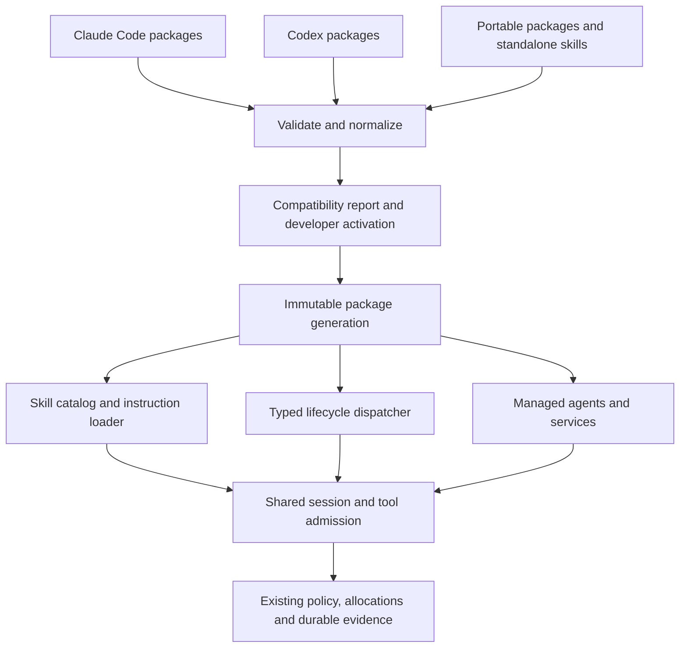

# Reuse Claude Code and Codex skills and plugins

Status: Draft 2026-09-09

DemonCoder will reuse Claude Code and Codex skills and plugins through one
complete extension runtime. Every component and lifecycle event below is required
before Done. Implementation order does not reduce the delivery scope. This draft
does not select a new Current commitment or claim that arbitrary upstream plugins
already work.

## Recommendation and alternatives

Build separate package importers over one DemonCoder extension runtime. Reuse
existing skill instructions, scripts and service declarations where their needs
can be met. Report compatibility before activation, down to the component and
field. Keep the original package unchanged and retain its origin and license.

| Approach | What the developer gains | Cost or limit |
|---|---|---|
| Compatible packages, shared DemonCoder runtime — recommended | Reuse from both ecosystems on every connection; consistent permissions, accounting and evidence | Importers need versioned fixtures; backend-specific features need adaptation or explicit rejection |
| Delegate plugins to their original backend | More original behavior on that backend | Native connections cannot use the same plugins; a second execution path can bypass DemonCoder controls |
| DemonCoder-only package format | One package dialect to maintain | Existing packages need conversion and authors must maintain another distribution |

Compatibility has three separate meanings: the loader can read the package;
its selected components have supported behavior; its external dependencies are
available. A successful parse alone establishes only the first. Instruction text
can also name unavailable tools or product features; inspection reports known
dependencies, while a real workflow smoke test establishes practical usability.
No importer can prove arbitrary natural-language instructions are portable.

## Package and skill contract

Import local directories through `/plugins install <path>` and standalone skills
through `/skills import <path>`. Installation copies a validated snapshot to the
application's own store. `/plugins` lists installed packages; its detail view
provides validate, enable, disable, reload and remove actions. `/skills` lists
available instructions and their origin. These are proposed product controls,
not existing commands.

The loader recognizes `.claude-plugin/plugin.json`, `.codex-plugin/plugin.json`
and portable Agent Plugins 1.0 root `plugin.json`. Portable identity and fixed
skill/MCP roots remain canonical. Inline `extensions.com.openai` replaces the
OpenAI overlay; when absent, the Codex overlay contributes those settings.
Independent legacy dialects require an explicit selection only when they are
actual alternatives. The full precedence, merge and discovery rules are in the
[compatibility contract](../spec/plugin-compatibility.md#manifest-precedence).
Manifest-free Claude components retain stable recorded identities.

The application records author, origin, declared version, content digest and
component identities. No version string is a substitute for the content digest.
Display-only unknown metadata is retained with a notice. Unknown execution fields
prevent component activation. Initially every declared executable component is
required; the developer can explicitly exclude one after seeing the resulting
partial compatibility report. A skill's declared dependency on an excluded
component keeps that skill unavailable.

| Source material | Proposed interpretation |
|---|---|
| `skills/<name>/SKILL.md`, declared skill paths, standalone `SKILL.md` | Shared instruction loader; name, description, references, scripts and assets retain provenance |
| Claude `commands/*.md` | Legacy skill commands with literal argument expansion |
| Claude root-skill fallback | Load when the package has no skills directory or declared skills path; use manifest identity as stable fallback |
| Claude invocation/frontmatter fields | Preserve explicit-only and visibility restrictions; validate accepted Boolean spellings; unsupported execution fields block that skill |
| Codex `agents/openai.yaml` | Read display metadata, implicit-invocation policy and declared dependencies; it is skill metadata, not a subagent definition |
| Codex `.app.json` and registered app references | Bind through explicit connector configuration and authentication; expose provider access restrictions without claiming an unavailable connection works |
| Hook declarations | Separate dialect parsers and tested event/result mapping; see below |
| MCP/LSP, agents, monitors, dependencies | Fully managed components in this deliverable |
| Themes, output styles, channels, workflow declarations | Validated terminal presentation, instruction styles, authenticated inbound messages and admitted workflow execution |

Use `/plugin:skill` as the canonical invocation. Accept Codex `$plugin:skill`
as an explicit invocation alias. An unqualified alias resolves only when unique;
otherwise the application shows the matching qualified names. Built-in control
commands remain reserved. Standalone skills receive a visible stable import
namespace. Claude `disable-model-invocation` and Codex
`policy.allow_implicit_invocation: false` both prevent implicit selection.

Load a bounded description catalog first, then the selected body on demand.
`$ARGUMENTS` and supported positional arguments are text substitutions. Dynamic
context commands declared in Markdown execute through normal admission, with
their result inserted as attributed context. Invocation arguments cannot create
new executable blocks. Reading references remains subject to file admission; scripts run only
through admitted tools. Package content is read-only, with separately granted
plugin data and scratch directories. Importing a skill cannot install its tools
or interpret its prose as authorization.

Opening a repository may show discovered `.agents` or project plugin candidates,
but never enables them. Existing Claude/Codex installation directories are explicit
import sources, not ambient execution roots. Application-bundled means shipped
with DemonCoder; it confers no additional operating-system privilege.

## Runtime ownership and architecture

Importers translate formats, not permissions. The normalized registry owns
identity and generation selection. The skill loader owns instruction assembly.
The dispatcher owns ordering and typed responses. Process/model/service runners
own execution and cleanup. The existing workflow store owns durable receipts.
Adapters expose only events they actually observe. No module needs to own a
second independent model/tool loop.

A task captures both the active code generation and its state generation under
the [state transaction contract](../spec/plugin-runtime-contract.md#mutable-state-and-activation). Reload validates a replacement at an idle
boundary; running work and children retain their captured generation. Failed reload
keeps the old generation usable. Disable prevents new admissions immediately and
cancels plugin background work. Required gates interrupted by disable leave their
tasks blocked until the authorized developer repairs the policy. The non-hooked
quarantine control always stops admissions, even if ConfigChange is broken. Old snapshots remain until
no task references them. Removal explains retained snapshots instead of deleting
files still needed for recovery.

Repair does not change an existing task's generation. The explicit developer
recovery action creates a linked replacement with fresh instructions and gates,
retained effect history and the same cumulative allowance. It atomically replaces
admission ownership; old tasks remain historical rather than being falsely completed.

## Lifecycle event matrix

These are native semantic boundaries. An upstream spelling maps here only when
its input and output behavior can be represented. Gate means it can prevent the
pending action; observer means it cannot retroactively reverse an action.

| Event | Timing and permitted effect |
|---|---|
| SessionStart | New/resumed session after identity and policy exist; context observer |
| InstructionsLoaded | After bounded instruction assembly; provenance observer |
| UserPromptExpansion | Explicit skill invocation before submission; admitted dynamic context and instruction expansion |
| UserPromptSubmit | Before the submitted turn is admitted; gate and bounded context |
| PreToolUse | Before final tool admission; gate or argument rewrite |
| PermissionRequest | When DemonCoder needs a developer decision; may deny or request input, never grant greater authority |
| PermissionDenied | After actual admission denial; observer, not a tool failure |
| PostToolUse / PostToolUseFailure | After immutable execution receipt; context/continuation decision without changing the recorded operation |
| Stop | Before normal completion of task work; bounded correction gate |
| StopFailure | After failed turn termination; observer |
| Interrupt / SessionEnd | Cancellation and shutdown observations; never veto cleanup |
| TaskCreated / TaskCompleted | Before admitting task creation/completion transition; gates, followed by recorded outcomes; completion never supplies developer acceptance |
| SubagentStart / SubagentStop | Existing manager starts/stops the child; attributed lifecycle handlers |
| WorktreeCreate / WorktreeRemove | Host-managed worktree lifecycle; supported custom creation runs through admitted commands and validates resulting ownership before use |
| PreModelSwitch / PostModelSwitch | Before/after an actual allowed connection change; gate then observer |
| ConfigChange | Before activating a validated settings generation; gate |
| Setup | Developer-invoked setup operation with explicit access; never automatic on install |
| Notification | Attributed runtime notification; observer |
| FileChanged | Bounded reconciled workspace observation |
| MessageDisplay | Presentation transform only; original model/tool evidence remains intact |
| Elicitation / ElicitationResult | Authenticated MCP input request/response before server delivery; typed accept/decline/cancel, never forged developer input |
| PostToolBatch | After all admitted operations in a declared batch settle; retain each operation's receipt |
| PreCompact / PostCompact | Before/after real context compaction; pre-action gate then observation or dialect-specific continuation hold |
| CwdChanged / DirectoryAdded | Actual session workspace transitions after access validation; shell `cd` alone is not this event |
| TeammateIdle | Before an assigned agent enters idle state; bounded follow-up or idle transition, preserving allocation and cancellation |

The shared lifecycle contract must work on all four connections. Implement missing
host operations as part of this commitment. Where a backend's private operations
are not observable, do not invent events or silently substitute host events with
different meaning. Record the concrete API limitation and resolve it through an
adapter change or an explicit developer decision about that particular behavior.
An unresolved required event blocks Done; an `unsupported` label is not completion.

## Handler behavior

The [runtime contract](../spec/plugin-runtime-contract.md) specifies final-candidate
admission, snapshot freshness, configuration recovery, mutable-state transactions,
workflow gates and delivery recovery. The
[compatibility contract](../spec/plugin-compatibility.md) specifies exact dialect
results, concurrent groups and the backend bridge. These detailed contracts govern
this overview; a generic three-value decision cannot replace their special results.

Transform first, then bind every required decision to the final request and
inspected input revision. A later rewrite invalidates older decisions. Never
replay effectful handlers just to revalidate a policy. A stale result leaves work
held until a fresh decision exists within the same allowance.

Actual mutation evidence remains immutable even when a post-operation handler
stops continuation or transforms model-facing output. Command execution uses
explicit confinement, environment and destinations; prompt and agent inspection
uses snapshot-bound evidence. All model usage consumes the owning task or explicit
session allowance. Cancellation and host quarantine cannot be vetoed by plugins.

The host alone authenticates developer answers. Package context, classifier
assertions, channel messages and rewritten output never become developer authority.

Handler substeps do not redispatch hooks by default. Explicit reentrancy is
bounded to depth four and rejects repeated event/handler/candidate cycles;
every substep still passes ordinary admission. Durable invocation records retain
identity, generation, input digest, timing, bounded outcome and usage without
secret input contents. Package-root variables resolve to the immutable snapshot.

### Initial resource limits

These proposed limits apply to the complete runtime; they are not upstream limits.
Rejected or truncated content must be visible. Structural JSON is rejected when
oversized; it is never truncated into an apparently valid decision.

| Resource | Initial limit |
|---|---|
| Imported package | 64 MiB total, 4,096 files after extraction; enforce path and expansion bounds before exposing imported contents |
| Active registry | 512 components total; refuse activation beyond the limit |
| Manifest/config file | 256 KiB each |
| Skill description/body/catalog | 1 KiB / 64 KiB / 32 KiB; catalog omission shown with access through `/skills` |
| Hook input/decision/log output | 256 KiB / 64 KiB / 1 MiB per invocation |
| Command/prompt timeout | Default 10 / 30 seconds; explicit override up to 120 seconds |
| Entire gate chain | Default 60 seconds; configured maximum 120 seconds, always bounded by remaining task time |
| Stop corrections | Existing remaining task limit, currently at most two; never reset by hooks |
| Monitor line/queue | 16 KiB / 64 messages per monitor; overflow stops intake with a durable gap/cursor and the defined resume controls |

Implementation must also cap concurrent runners using existing task allocations;
dispatch ordered groups sequentially per owning event, with the source-defined
concurrency inside each group. Async handlers use bounded
queues, explicit owners and cancellation; they cannot serve as gates after admission.

## Workflow plugins

Ship both Best Practices and Cairn packages in full, optional to enable. The
[workflow contract](../spec/plugin-runtime-contract.md#bundled-workflow-obligations)
names the real obligations and maps every referee verdict to a runtime action.
Best Practices checks current executed checks, current review, unfinished work,
remaining allowance and explicit acceptance against typed runtime receipts. Its
policy is developer-approved; a demonstration-only marker file cannot satisfy it.
The skill/reviewer handles judgment without claiming mechanical proof of prose.
Cairn Done discharges only its referee gate; other verification and acceptance
requirements remain. Normal DemonCoder use still does not require Cairn.

## Services, agents and distribution

Agent template fields map to existing assignment settings: name/description for
selection, model/effort for the requested connection, maxTurns for a tighter
allocation, tools/disallowedTools for a restriction of existing authority, skills
for the child's pinned catalog, memory for isolated plugin-owned state, and
background/isolation for visible scheduling and owned worktrees. No requested
field can increase a child's authority. Missing models or tools block assignment
with a repair action. A read-only hook agent differs from a coding agent template:
the latter may write within its ordinary explicit ownership.

MCP services support stdio and Streamable HTTP, tool discovery, independent
enablement, bounded requests, credential binding and visible connection status.
Imported legacy transport requirements must be implemented and tested when named
by the agreed compatibility fixtures, not silently converted. LSP configurations
map commands, arguments, environment, language/extension registrations,
initialization options, request/startup/shutdown deadlines and bounded crash
restart settings onto the managed service layer. Existing file filtering and
diagnostic freshness remain mandatory. Unchanged services survive reload when
their complete identity and policy are unchanged. Changing credentials or access
policy is a service change even if the command string stays the same.

Monitors run when an authorized enabled package becomes active, stop on disable
or owner shutdown, and use attributed bounded line delivery. This explicitly
differs from the supplied Claude behavior that retains monitors until session end.
Channels use an admitted MCP server and authenticated sender binding. Both use
deduplication identifiers where available, retain delivery status, and never turn
external content into developer approval. A trigger can request agent work only
under a configured allocation; it cannot create unlimited background tasks.

Configuration forms expose types, defaults, required fields, validation errors
and secret indicators. Non-sensitive values may enter declared skill/agent context;
secrets enter only the explicitly authorized process or authenticated transport.
Provider app identifiers resolve through an explicit connector binding, not by
assuming that a Codex account or installed backend implies service access.
Revocation stops new authenticated work and leaves pending effects reconciliable.

Themes map upstream tokens to documented terminal tokens and show unmapped tokens
before selection. Selection persists by plugin identity and theme slug. Missing
or disabled themes fall back to the previous valid built-in preset. Output styles
shape presentation/instructions without overriding host controls or original
evidence. Plugin theme editing creates a user copy.

Support user, project, private local-project and managed scope. Managed policy constrains
all lower scopes; explicit developer choices resolve same-name package conflicts.
The UI shows every origin and the active selection. Project discovery never
silently authorizes executable components. Author controls include package init,
validation, component diagnostics and explicit reload of an imported development
snapshot; publication is an explicit action.

Marketplace controls add/list/remove sources, search packages, inspect provenance,
install, update and uninstall. Support local catalogs, Git repositories and
downloaded packages with pinned revisions/digests. Resolve the whole dependency
graph before activation; bound graph size at the registry limit, reject cycles
and incompatible requirements, and show dependent breakage before removal.
Downloads extract into staging with path, file-count and expanded-size limits.
Commit activation atomically only after verification, configuration and trust
choices are complete. Failed updates preserve the last working generation and
cached packages remain usable offline. Upstream account-synced private catalogs
require an authorized documented endpoint; absent provider access is a concrete
constraint to resolve, not grounds for silently claiming full compatibility.

## One complete commitment

Proposed commitment: `skills-plugins-hooks`. It includes EXT-001 through EXT-009,
HOOK-001 through HOOK-011, PLUG-001 through PLUG-011, PRUN-001 through
PRUN-006 and PCOMP-001 through PCOMP-004 in full. No component is
postponed to a separate release. Optional means the developer may choose whether
to enable a delivered plugin, not whether we implement its support.

Implementation follows dependencies: package registry and schema normalization;
skill loading and lifecycle dispatch; command/model runners and durable state;
agents, MCP/LSP, connectors, monitors and channels; presentation and distribution;
then end-to-end compatibility and recovery validation. Work may overlap where
independent. This order creates no intermediate definition of Done.

Done requires working package management and author validation; standalone and
packaged skills from both ecosystems; all five hook types; the full event matrix;
agents and workflows; MCP/LSP services; configured apps; monitors and channels;
themes and output styles; scopes, marketplaces, pinned updates and dependencies;
both bundled workflow examples; all four connection checks; negative-path and
recovery demonstrations; documentation; and a clean commitment review.

Use the complete [frozen profile inventory](../spec/compatibility/plugin-profile-v1.json),
including its five pinned real package trees, source/schema digests and required
synthetic cases. Exercise every inventoried component and field through production
paths; no implementation-local fixture substitution or coverage exclusion is allowed. A parser-only test, disabled feature,
placeholder runner or compatibility warning cannot satisfy a required feature.
Provider-controlled unavailable accounts or private APIs need a named limitation
and explicit scope decision, never an automatic reduction of this deliverable.

## Verification and source observations

Every requirement has a falsifier and proposed mechanism in
[extensions](../spec/extensions.md), [hooks](../spec/lifecycle-hooks.md) and
[components and distribution](../spec/plugin-components.md),
[runtime state and admission](../spec/plugin-runtime-contract.md), and
[compatibility](../spec/plugin-compatibility.md). These are test designs, not
recorded passing evidence. Use actual effects in temporary workspaces to prove
denial, not only a mocked handler's return value. Pair violating and corrected
cases. Exercise process descendants, private canaries, stale approvals, generation
races, interruption and malformed responses. Test all four adapters using controlled
transports; retain separate installed and live-provider smoke evidence.

The source review found useful existing boundaries:

| Existing source | Reuse and missing behavior |
|---|---|
| `src/tools.rs` | `ToolHook` supports pre-execution mutation and separate result presentation; shared execution already rechecks modified arguments. No package loader or asynchronous lifecycle dispatcher exists. |
| `src/session.rs`, `src/native.rs` | Session/turn and native tool boundaries; native recovery already avoids blindly replaying uncertain effects. |
| `src/adapters/claude.rs`, `src/adapters/codex.rs` | External backends disable inherited extension paths and use shared tools; preserve one admission owner. |
| `src/workflow/mod.rs`, `src/workflow/store.rs` | Existing task controls, durable state and explicit acceptance; extend these instead of adding a separate gate truth store. |
| `src/learning/context.rs` | Bounded repository instructions and approved lessons; skills need a separate catalog with their own provenance. |
| `src/subagents/state.rs` | Existing assignment identity, ownership and allocations; plugin agents should be templates over this manager. |

The current Cairn commitment remains `managed-language-services`; `cairn wake`
reported Done during this drafting task. No runtime implementation is authorized
by this document's Draft status.

### Compatibility references

The developer supplied the Claude plugin reference as a package baseline.
[Claude's plugin reference](https://code.claude.com/docs/en/plugins-reference)
and [hook reference](https://code.claude.com/docs/en/hooks) describe that dialect;
the [Agent Skills specification](https://agentskills.io/specification) supplies
the shared skill format. Reference date: 2026-09-09. The frozen profile pins Claude SDK 0.3.267,
Codex rust-v0.153.4 source commit, portable schemas and real package tree identities.
Those artifacts fix coverage independently of changing documentation pages.

OpenAI's [package documentation](https://developers.openai.com/plugins/build/plugins)
describes portable root `plugin.json`, the `.codex-plugin/plugin.json` compatibility
layout, and `extensions.com.openai` settings. Its
[skill documentation](https://learn.chatgpt.com/docs/build-skills) describes
`agents/openai.yaml` and explicit-only invocation policy. Its
[hook documentation](https://learn.chatgpt.com/docs/hooks) describes event-specific
outputs and local-tool coverage limits. Those differences justify separate
import profiles and visible incompatibility rather than treating all hooks alike.
